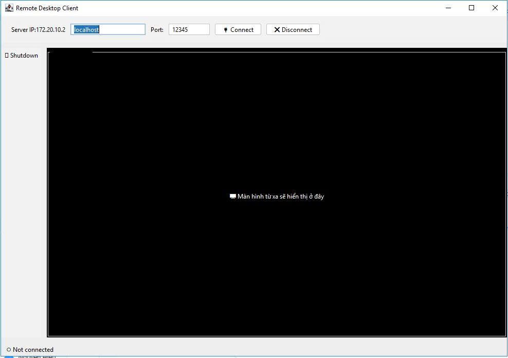
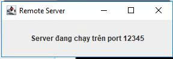

<h2 align="center">
    <a href="https://dainam.edu.vn/vi/khoa-cong-nghe-thong-tin">
    🎓 Faculty of Information Technology (DaiNam University)
    </a>
</h2>
<h2 align="center">
  ỨNG DỤNG ĐIỀU KHIỂN MÁY TÍNH TỪ XA
</h2>

    

        
        
        
    

## 📖 1. Giới thiệu hệ thống
    Ứng dụng điều khiển máy tính từ xa (Remote Control) 
- Cho phép người dùng truy cập, theo dõi và điều khiển máy tính ở xa thông qua mạng Internet hoặc mạng LAN.
- Hệ thống cho phép một máy tính (Client) có thể kết nối và điều khiển một máy tính khác (Server/Host) theo thời gian thực.
- Máy chủ (Remote Server): là máy tính bị điều khiển, có nhiệm vụ chia sẻ màn hình và tiếp nhận các lệnh điều khiển từ xa.
- Máy khách (Remote Client): là máy tính điều khiển, có nhiệm vụ hiển thị màn hình từ xa và gửi các thao tác chuột, bàn phím đến máy chủ.
- Người dùng có thể xem toàn bộ màn hình của máy từ xa.
- Thao tác chuột, bàn phím như ngồi trực tiếp trước máy.
- Giao diện đơn giản, dễ sử dụng, có thể mở rộng thêm tính năng bảo mật và xác thực.
- Làm việc từ xa (Remote Work).
- Quản trị hệ thống & server.

## 🔧 2. Công nghệ sử dụng
🖥️ Java RMI (Remote Method Invocation)

Được dùng để triển khai mô hình Client-Server phân tán.

Server cung cấp các phương thức điều khiển từ xa (shutdown, restart, disconnect, mở ứng dụng, gửi tin nhắn, điều khiển chuột, bàn phím…).

Client gọi trực tiếp các phương thức từ Server thông qua RMI, mà không cần quản lý chi tiết kết nối TCP socket.

RMI cho phép truyền đối tượng, dữ liệu (ví dụ: ảnh màn hình) qua mạng một cách thuận tiện và bảo toàn kiểu dữ liệu.

🎨 Java Swing

Xây dựng giao diện người dùng (GUI) cho Client:

JFrame, JPanel: Tổ chức giao diện chính.

JButton, JTextField, JComboBox: Cho phép nhập lệnh hoặc chọn hành động điều khiển.

JTextArea: Hiển thị trạng thái, log kết nối và phản hồi từ Server.

JOptionPane: Hiển thị thông báo hoặc xác nhận khi thực hiện thao tác nguy hiểm (shutdown, restart).

⚙️ Mô hình hoạt động

Server: Chạy ngầm trên máy cần điều khiển, luôn trong trạng thái sẵn sàng nhận lệnh.

Client: Người dùng nhập IP + Port để kết nối đến Server. Sau khi kết nối thành công có thể gửi các lệnh từ xa.

Kết nối TCP đảm bảo dữ liệu được truyền tin cậy và theo thứ tự.

Hỗ trợ:

Có thể mở rộng với Java RMI hoặc Socket bảo mật (SSL).

Dễ tích hợp thêm các tính năng nâng cao: truyền file, chia sẻ màn hình, chat.

## 🚀 3. Hình ảnh các chức năng

 
 
 
 <em>Hình 1: Giao diện Client – cho phép nhập IP, Port, và gửi lệnh đến Server.</em> 
 
 
 
 
 <em>Hình 2: Giao diện Server – hiển thị log kết nối và lệnh nhận được từ Client.</em> 

## 📝 4. Hướng dẫn cài đặt và sử dụng
🔧 Yêu cầu hệ thống

Java Development Kit (JDK): Phiên bản 8 trở lên.

Hệ điều hành: Windows, macOS, hoặc Linux.

Môi trường phát triển: Eclipse / IntelliJ IDEA / VS Code hoặc terminal.

Dung lượng: khoảng 20MB cho mã nguồn và file thực thi.

### 📦 Cài đặt và triển khai
Bước 1: Chuẩn bị môi trường

Kiểm tra Java:

java -version
javac -version

Tải mã nguồn: clone project từ GitHub hoặc giải nén file.

Bước 2: Biên dịch mã nguồn

Mở terminal, điều hướng đến thư mục src.

Biên dịch toàn bộ project:

javac src/**/*.java

Bước 3: Chạy ứng dụng

Khởi động Server:

Mở ServerMain.java và chạy.

Server sẽ khởi động và lắng nghe tại IP:Port cấu hình sẵn.

Khởi động Client:

Mở ClientMain.java và chạy.

Nhập IP của Server + Port → nhấn Connect.

Sau khi kết nối thành công, có thể chọn lệnh (shutdown, restart, mở app, gửi tin nhắn…).

### 🚀 Sử dụng ứng dụng

Kết nối

Nhập IP và Port của Server.

Nhấn Connect để kết nối.

Điều khiển máy tính từ xa

Chọn lệnh từ menu hoặc nhập trực tiếp.

Ví dụ:
.
📤 Connect: Ngắt kết nối Client-Server.
📤 Disconnect: Ngắt kết nối Client-Server.

Theo dõi log

Tất cả lệnh và phản hồi sẽ hiển thị trên giao diện Client và Server.

## 5. Liên Hệ

Họ tên: Nguyễn Minh Hiếu

Lớp: CNTT16-03

Email: minhhieu010904@gmail.com

Zalo: 0369864785

© 2025 AIoTLab, Faculty of Information Technology, DaiNam University. All rights reserved.
---
